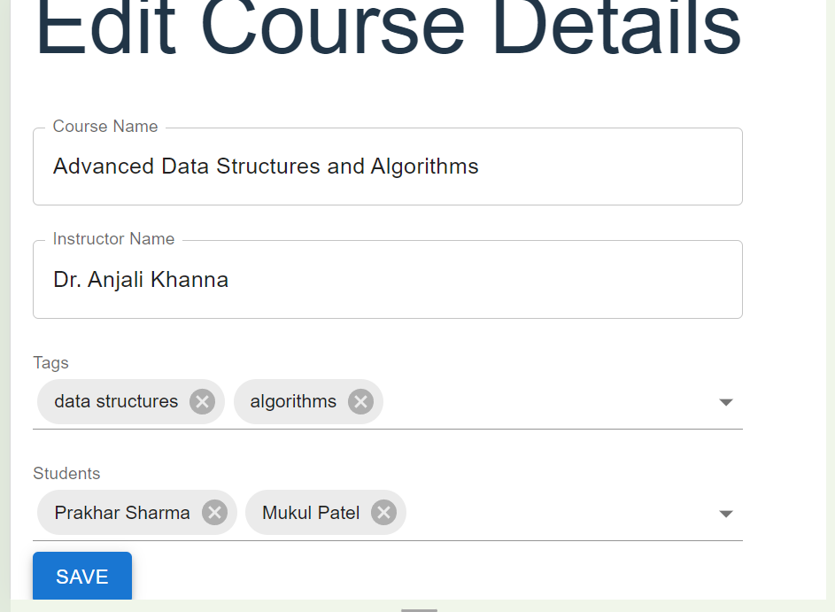
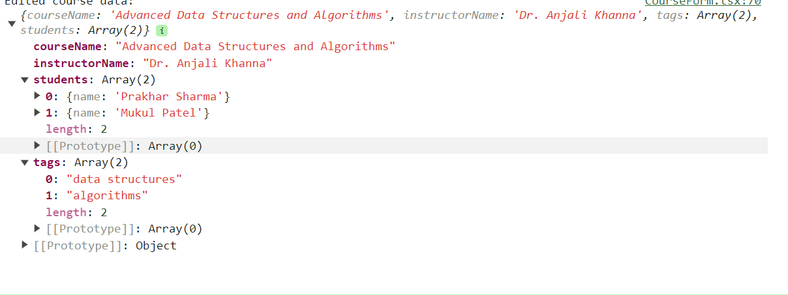

# React + TypeScript + Vite

# Course Management App

## Deployment

- I have deployed it on Netlify. Click on the following link to access the deployment:
-  [Deployment Link](https://6612faf2914aadf98c89c7c5--fluffy-haupia-39c3f7.netlify.app/)

# landing page

# On click Upadte redirect to this 

# After edit if we click save then it will look like this in console

This is a simple React application for managing courses, implemented using TypeScript and Material-UI.

# Features
View a list of available courses
Edit course details, including name, instructor, tags, and enrolled students
Add and remove tags for a course
Add and remove students from a course
# Technologies Used
React.js
Material-UI
Axios
# How to Run
Clone the repository to your local machine.
Navigate to the project directory.
Install dependencies using npm install.
Start the development server using npm start.
Access the application in your browser at http://localhost:3000.
# Folder Structure
- src/components/course: Contains components related to course management, such as CourseEditForm and CourseEdit.
- src/api: Contains API functions for fetching course data, student data, and tag data.
- src/App.tsx: Main application component, containing routing configuration.

